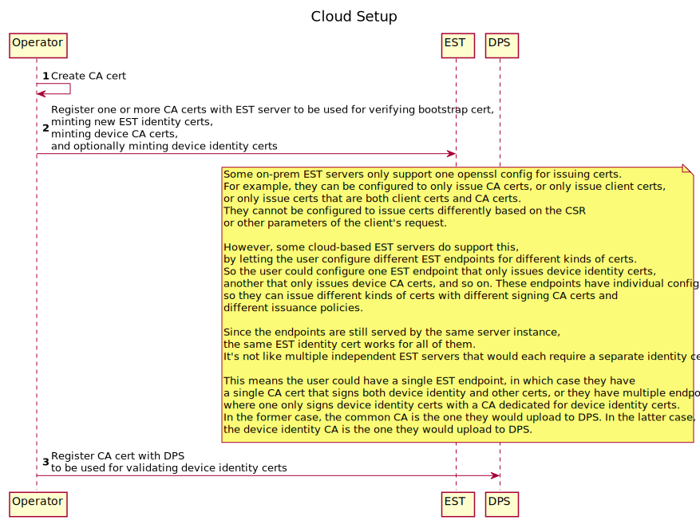
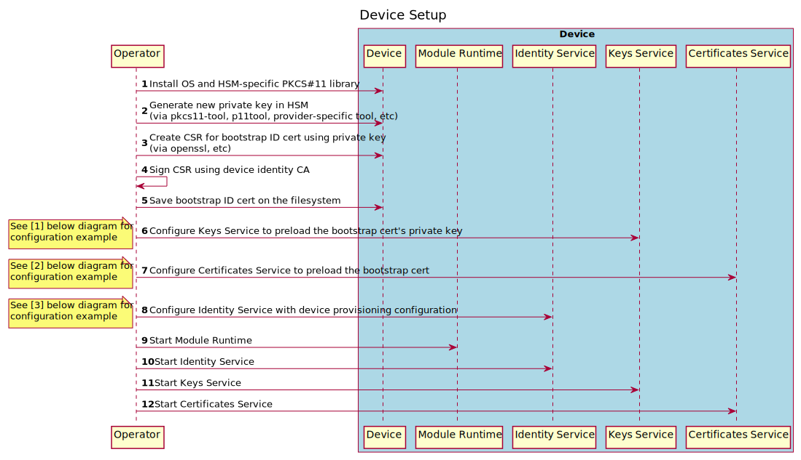
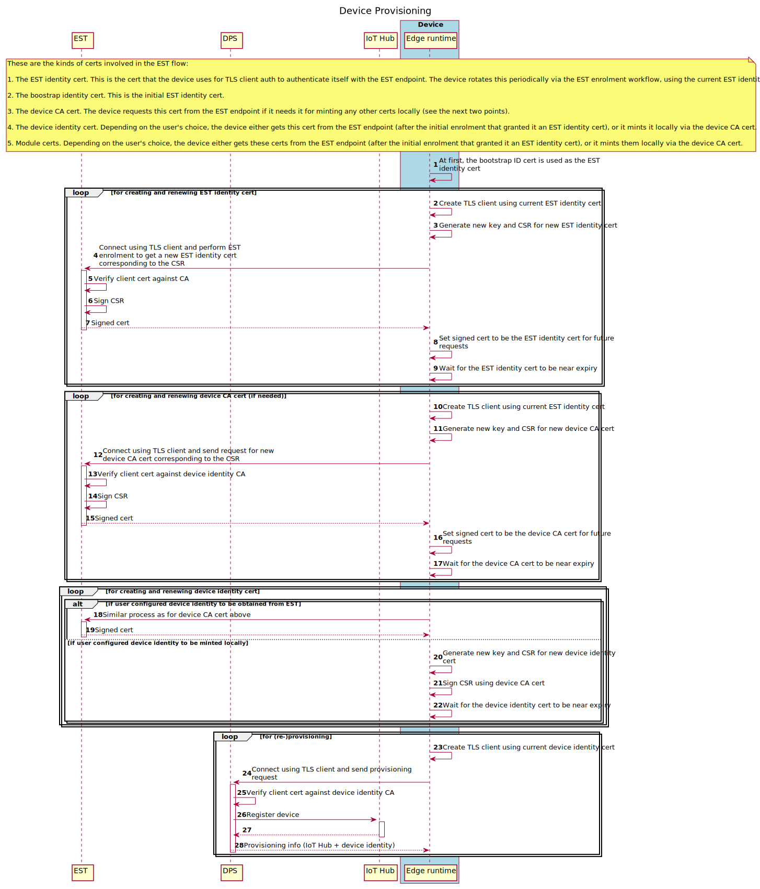
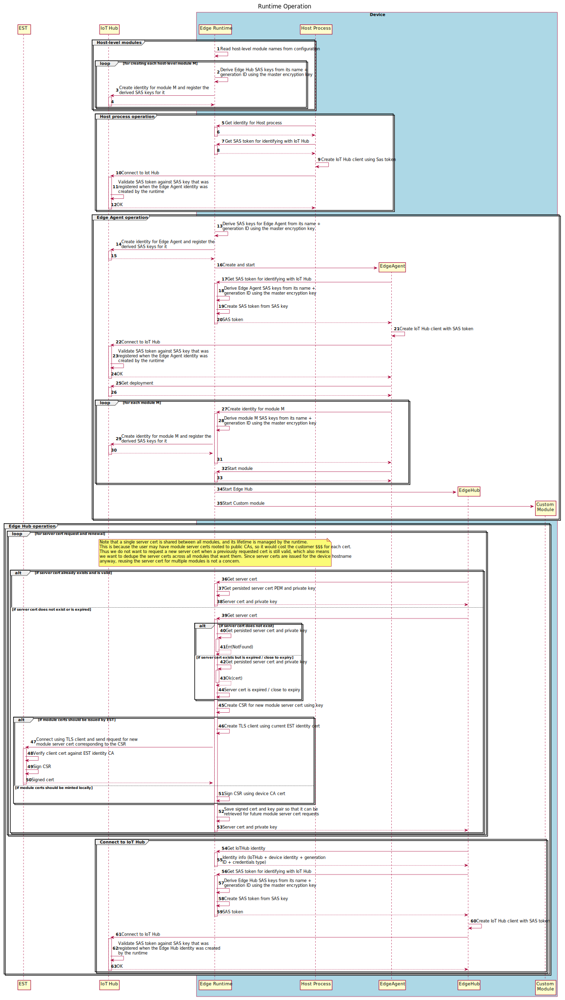

# Provisioning using EST, with certificates issued by EST (private PKI)

---



---



---



[(Click here for detailed version)](img/est-ca-provisioning-detailed.svg)

---



[(Click here for detailed version)](img/est-ca-runtime-operation-detailed.svg)

---

1. KS configuration

    ```toml
    [pkcs11]
    "lib_path" = "/usr/lib/hardware-specific-pkcs11-library.so"
    "base_slot" = "pkcs11:slot-id=0?pin-value=1234"

    [preloaded_keys]
    "bootstrap" = "pkcs11:slot-id=0;object=device%20id?pin-value=1234"
    ```

1. CS configuration

    ```toml
    "homedir_path" = "/var/lib/iotedge/cs"

    [cert_issuance]
    device-ca = "est" # Only needed if one of the others has the value "device-ca"
    device-id = "est" # or "device-ca" for minting locally
    module-id = "est" # or "device-ca" for minting locally
    module-server = "est" # or "device-ca" for minting locally

    [cert_issuance.est]
    "method" = "x509"
    "identity_cert" = "est-id"
    "identity_pk" = "est-id"
    "bootstrap_identity_cert" = "bootstrap" #optional
    "bootstrap_identity_pk" = "bootstrap" #optional

    [cert_issuance.est.urls]
    # Default EST endpoint URL
    default = "https://estendpoint.com/.well-known/est/simpleenroll"

    # EST endpoint URL specifically for the est-id cert
    "est-id" = "https://estendpoint.com/.well-known/est/est-id/simpleenroll"

    # EST endpoint URL specifically for the device-id cert
    "device-id" = "https://estendpoint.com/.well-known/est/device-id/simpleenroll"

    # EST endpoint URL specifically for the device-ca cert
    "device-ca" = "https://estendpoint.com/.well-known/est/device-ca/simpleenroll"

    [preloaded_certs]
    "bootstrap" = "/var/secrets/bootstrap.cer"
    "est-ca" = "/var/secrets/est-ca.cer"
    "trust-bundle" = [
        "est-ca",
    ]
    ```

1. IS configuration

    ```toml
    [provisioning]
    "source" = "dps"
    "scope_id" = "<ADD dps SCOPE ID HERE>"

    [provisioning.attestation]
    "method" = "x509"
    "identity_cert" = "device-id"
    "identity_pk" = "device-id"

    ```

The elements in the `trust-bundle` array and the `provisioning.attestation.identity_cert` value are certificate IDs defined in the CS's `preloaded_certs` table.

The `provisioning.attestation.identity_pk` value is a key ID defined in the KS's `preloaded_keys` table.
