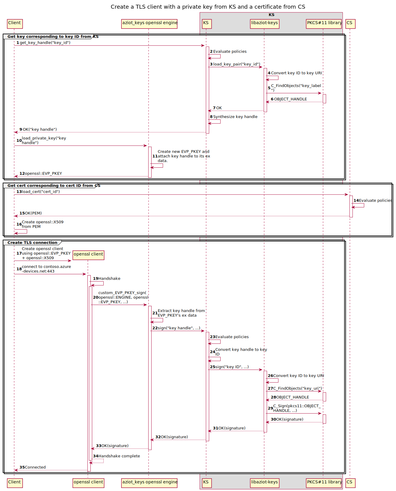

# OpenSSL engine internals


This document talks about some basic crypto concepts, how the openssl API works, how openssl engines work, and how KS, libaziot-keys, and the two openssl engines used by it are structured.


## Keys

There are two types of keys - symmetric and asymmetric keys.


### Symmetric keys

#### Generation

A symmetric key is a sequence of random bytes. There is nothing special about the method used to generate a symmetric key; any CSPRNG can be used to read off some bytes to be used as a key.

#### Encryption

If a symmetric key is used to encrypt plaintext to get ciphertext, the same key is needed to decrypt the ciphertext back to plaintext. Depending on the algorithm, additional data may be involved in the process. For example, libaziot-keys uses the AES-GCM algorithm, which uses an IV buffer and an AAD buffer in addition to the plaintext / ciphertext:

```
aes_gcm_encrypt(key, plaintext,  iv, aad) -> ciphertext
aes_gcm_decrypt(key, ciphertext, iv, aad) -> plaintext
```

The encryption process also produces a "tag", and the decryption process requires it, but it can essentially be treated as part of the ciphertext. For example, the implementation can prefix it to the actual ciphertext since it has a constant length. This is what libaziot-keys's implementation also does.

#### Signing

A symmetric key can be used to sign an input using an algorithm like HMAC-SHA256. A signature validates that the input has not been modified outside of the knowledge of the holder of the key used to create the signature.

```
hmac_sha256_sign  (key, input           ) -> signature
hmac_sha256_verify(key, input, signature) -> ok/invalid
```

(Technically "signing" refers to digital signatures, which are only created from asymmetric keys. However there are enough results on the internet that refer to HMAC as "signing" that we also refer to it as "signing" here. Indeed, the `/sign` workload API exposed by `iotedged` today uses HMAC-SHA256 with the module's identity key.)


### Asymmetric keys

#### Generation

An asymmetric key is a pair of keys - a private key and a public key. Both are sequences of bytes, but they are not random. Rather, they are computed using some algorithm.

For RSA keys, first one chooses an exponent `e` (commonly 65537 aka 0x10001 aka `openssl_sys::RSA_F4`). Next, one chooses a modulus `n` of a desired length (2048 bits, 4096 bits, etc) such that it is the product of two prime numbers `p` and `q`. Lastly, one finds the number `d` such that `(d * e) % ((p - 1) * (q - 1)) = 1`. `d` is the private key, and `n` and `e` together make up the public key.

For EC keys, the various choices of groups like secp256r1 / secp384r1 / secp521r1 correspond to different elliptic curves (a set of points in a 2-D plane) and their corresponding "base" points. After choosing a group, one chooses a number `d` and then performs scalar multiplication of the curve's base point by `d` to get the point `Q`. `d` is the private key, and the group name and `Q` make up the public key.

#### Encryption

With asymmetric keys, the plaintext is encrypted with one of the keys and decrypted with the other key. However, encryption with asymmetric keys requires longer keys than the equivalent symmetric keys that provide the same level of security, and are slower than the encryption algorithms of such symmetric keys. Furthermore, the implementation of encryption in openssl requires that the plaintext be smaller than the asymmetric key, which is a reflection of the underlying encryption algorithm; encrypting longer plaintext would require manually chunking the plaintext into blocks like with CBC.

Thus asymmetric keys are generally used with a hybrid encryption process instead, where the asymmetric key is used to encrypt a symmetric key, and this symmetric key is used to encrypt the plaintext. TLS also works this way; the client and server generate a new symmetric key as part of the TLS handshake process, and use this key to encrypt the rest of the session traffic. As mentioned above, the symmetric key can be smaller than the asymmetric key while providing the same level of security, and can thus also be easily encrypted by the asymmetric key.

#### Signing

Just like with encryption, signing an arbitrary plaintext with an asymmetric key is not a practical approach. Rather, digital signatures work by taking a hash of the plaintext, called a digest, such that the digest is the same length as the key or smaller. This digest is then encrypted with the private key to get the signature. Thus the signature scheme involves both the key algorithm (which determines the encryption algorithm) as well as the hash algorithm used to compute the digest.


## openssl

### Types

openssl represents asymmetric keys using the `EVP_PKEY*` opaque pointer type. The pointee stores inside itself an `RSA` object if it is an RSA key, or an `EC_KEY` object if it is an EC key. These inner objects store the algorithm-specific parameters mentioned above. There are getters and setters for these inner objects.

The openssl functions for signing are `RSA_sign` that takes an `RSA` object and `ECDSA_do_sign` that takes an `EC_KEY` object. An `RSA` object or an `EC_KEY` object can be constructed from just the public components of the key, or they may optionally also hold the private components. In other words, even though an asymmetric key is a pair of keys, the `RSA` and `EC_KEY` objects can store both the private and public components together.


### Engines

openssl's `EVP_PKEY*` objects can be created by deserializing the key bytes from DER or PEM format. With this, the key material is held in memory. Of course, this cannot be done when the key material lives in hardware, ie an HSM. To support these cases, openssl has a concept of "engines".

At a high level, an engine is an object registered with openssl that can be used with `ENGINE_load_public_key(e, key_id) -> EVP_PKEY` and `ENGINE_load_private_key(e, key_id) -> EVP_PKEY` The `key_id` is an arbitrary string that openssl passes verbatim to the engine, and thus can be anything that the engine understands. For example, an engine that wraps PKCS#11 can take a PKCS#11 URI (`pkcs11:token=foo;object=bar?pin-value=1234`) as the key ID. Once the function has returned an `EVP_PKEY`, the rest of openssl's API can be used with it just like with a regular `EVP_PKEY` created from deserializing a DER into an in-memory `EVP_PKEY`

But as mentioned above, the `EVP_PKEY` contains `RSA` or `EC_KEY` objects which contain the private components of the key. Since these components are held by the HSM, how does the engine set them inside the `RSA` or `EC_KEY` objects? The answer is that it does not. While the `RSA` and `EC_KEY` objects do need to store the public components, they don't need to store the private components. Instead they can store "methods", which are functions used to perform operations that would require those private components.

For example, when loading an EC key from PKCS#11, the engine gets the public components of the key, ie the name of the group and the key point `Q`, from the PKCS#11 library, and uses these to instantiate an `EC_KEY` object. It then creates an `EC_KEY_METHOD` object with `EC_KEY_METHOD_new` and overrides its sign function with `EC_KEY_METHOD_set_sign` to a function defined inside the engine. When openssl wants to sign a digest with the `EC_KEY` representing the private key, openssl notices that this `EC_KEY` has its own `EC_KEY_METHOD` with a custom sign function, and calls that function instead of its built-in implementation. The built-in implementation would've needed the `EC_KEY` to contain the private components, but the custom sign function implemented by the engine uses PKCS#11 to perform the sign operation.

Thus the engine uses methods to override any functions that openssl implements which would need access to the private components, and its implementations of those functions forward to the underlying hardware.

Devnote: There is no replacement for reading the openssl source code to figure out how the openssl functions access the methods of the `RSA` and `EC_KEY` objects interally so that you know which ones to set and how they should work. Online documentation about this is insufficient or non-existent. Installing your distro's equivalent of the source package of openssl is recommended.


## API flow

Let's trace an operation where a client uses a certificate from CS, whose private key is held by the KS, for client auth in a TLS connection to a server.


