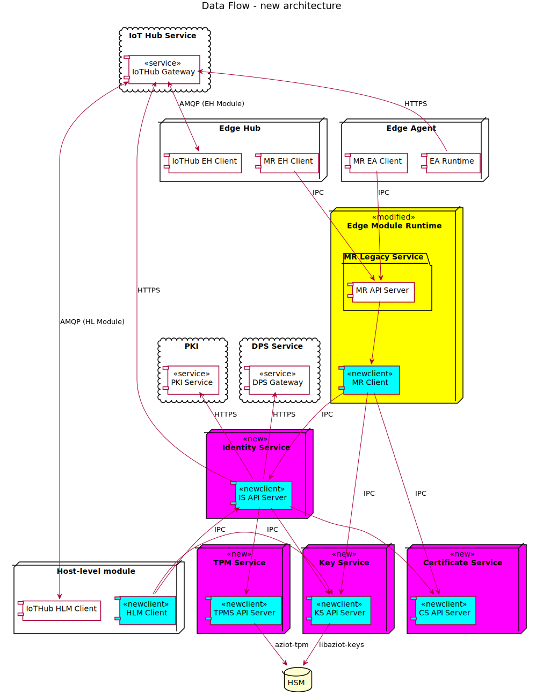

# Overview

IoT Identity Service is made up of three services that provide provisioning and cryptographic services:

- [Identity Service](identity-service.md)

    This service provisions the device identity and module identities with Azure. 

    The Identity Service provides access to host-level processes and container modules to connect to the cloud using tokens or X.509 certificate credentials, corresponding to their respective identities.

    Note that this service performs the entirety of provisioning.

- [Keys Service](keys-service.md)

    This service stores cryptographic keys, and allows callers to perform operations with those keys like encrypt, decrypt and sign. The service protects the keys by storing them in HSMs, and ensures that no operations against those keys export the keys to the device's memory.

- [Certificates Service](certificates-service.md)

    This service stores certificates, and allows callers to import and export them. Depending on the certificate issuance method, the Certificate Service may also provision certificates from a user-provided certificate issuer endpoint via a protocol like EST.

Each component talks to the other components via IPC in the form of HTTP-over-UDS.

[(Click here for detailed version)](img/new-component-overview-detailed.svg)

# Provisioning and Runtime Operation

This spec covers the following modes of provisioning and runtime operation.

- [Provisioning using EST, with certificates issued by EST (On-prem PKI)](est-ca.md)

# Misc

- [openssl engine internals](openssl-engine-internals.md)

- [Developer documentation](dev/_index.md)
