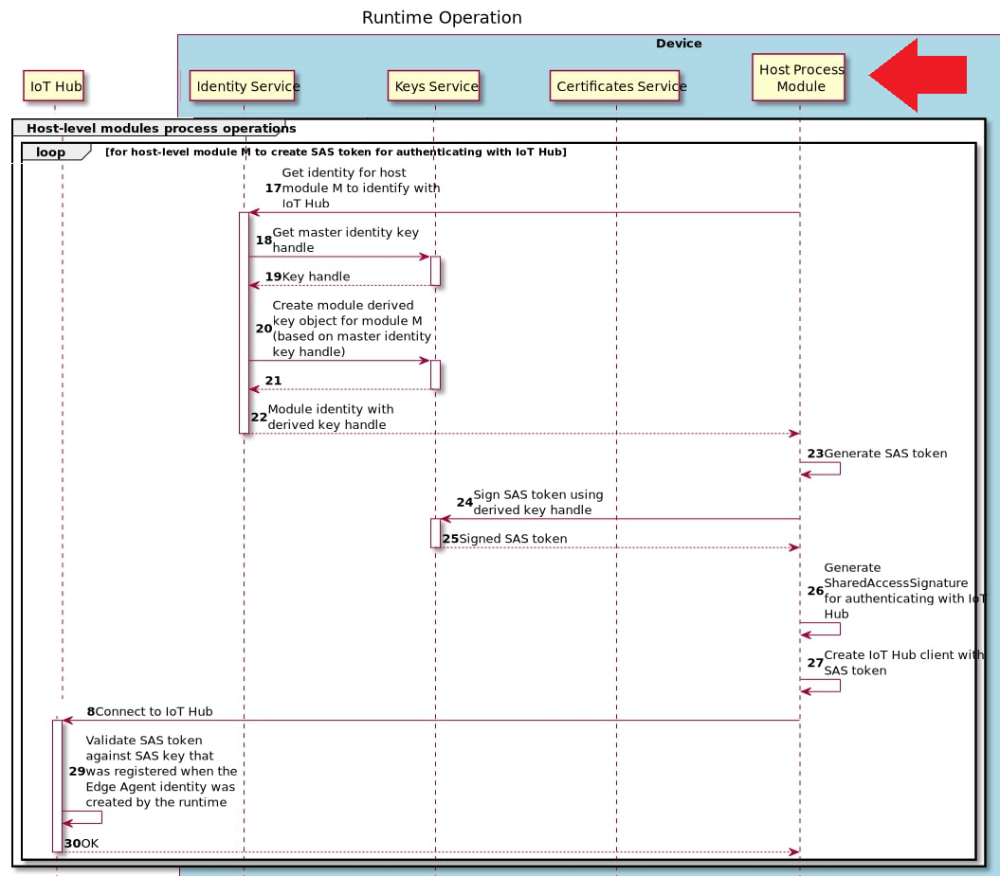

# Developing an IoT Agent
---

**TODO**

1. Need to show steps in the X.509 section on registering to use device identity for testing and then link from the section earlier where it's referenced.
1. Question: what is the `auth.type` from `GET /identities/identity?api-version=2020-09-01` when a TPM is used? does use of TPM change any of the steps for dealing with this as device identity
1. Consider including references to other samples. For example, the Device Update agent's code is an E2E example. Although, it doesn't implement any logic to refresh the token before it expires. They set it for a 3 month time and decided that was longer than the expected lifetime of the agent such that it would be unnecessary in their case.
   1. DU agent utility functions

        https://github.com/azure/iot-hub-device-update/blobl/main/src/utils/eis-utils

   1. DU agent calling to get the provisioning info
   
        https://github.com/Azure/iot-hub-device-update/blob/7a6e4c12d54df7a92984e935c3050f35e359a342/src/agent/src/main.c#L656 

   1. Using the OpenSSL engine with the C SDK

        https://github.com/Azure/iot-hub-device-update/blob/7a6e4c12d54df7a92984e935c3050f35e359a342/src/agent/src/main.c#L518

---

This document covers how a Linux process (e.g. a systemd service) can leverage APIs exposed by the [identity](../identity-service.md) (IS), [keys](../keys-service.md) (KS), and [certificates](../certificates-service.md) (CS) services to establish a connection to Azure IoT Hub using a [module identity](https://docs.microsoft.com/en-us/azure/iot-hub/iot-hub-devguide-module-twins). A _module identity_ is the same cloud identity used by [Edge modules](https://docs.microsoft.com/azure/iot-edge/iot-edge-modules#module-identities) to communicate with IoT Hub. 

The APIs for IS/KS/CS are all exposed to processes on the local host over Unix Domain Sockets (UDS). The services enable your agent (or, more generally, any authorized process) to co-exist side by side with other agents as well as IoT Edge modules (if IoT Edge is installed). They all appear as modules under the same logical device in IoT Hub and can be accessed via your back-end cloud solution. 


> **Note**
>
> The IS/KS/CS services can also be used by a process to connect to Hub using the device identity. However, in practice, that should not be used. The device identity is more privileged than a module identity as it has ownership for the module identities. 
>
> Furthermore, two separate processes cannot simultaneously connect to Hub using the same identity. Unless you own the device and can guarantee that only your process will ever use the device identity, you should stick to using a module identity. 

**Differences with Edge modules**

[IoT Central](https://docs.microsoft.com/azure/iot-central/core/overview-iot-central) only supports Edge modules. It does not provide UI for arbitrary agents using a module identity to connect to Azure.

The Identity Service package does not provide non-Edge modules with higher-level capabilities that come with IoT Edge.

Edge modules are managed through the [IoT Edge runtime](https://docs.microsoft.com/azure/iot-edge/about-iot-edge#iot-edge-runtime) which enables:
- Deploying cloud workloads to an edge device
- Monitoring the health of the deployed Edge modules
- Gathering and reporting runtime quality metrics
- Managing communication between Edge modules
- Remotely restarting a module or retrieving logs

## Prerequisites

### Installation

The IS/KS/CS services are installed as part of the [aziot-identity-service package](../packaging.md). 

> **Note**
>
> By design the package conflicts with the `iotedge` and `libiothsm-std` packages. If you're using `apt` to install the package it will prompt to remove the conflicting packages.  Otherwise, be sure to manually remove them before installing the Identity Service.

#### Install using apt (Ubuntu 18.04 and Raspberry Pi OS Stretch)

```bash
sudo apt install aziot-identity-service
```

You may need to first add the `packages.microsoft.com` to your repo sources.

1. Install the Microsoft GPG public key

    ```bash
    curl https://packages.microsoft.com/keys/microsoft.asc | gpg --dearmor > microsoft.gpg
    sudo cp ./microsoft.gpg /etc/apt/trusted.gpg.d/
    ```

2. On Ubuntu 18.04

    ```bash
    curl https://packages.microsoft.com/config/ubuntu/18.04/multiarch/prod.list > ./microsoft-prod.list
    sudo cp ./microsoft-prod.list /etc/apt/sources.list.d/
    ```

3. On Raspberry Pi OS Stretch

    ```bash
    curl https://packages.microsoft.com/config/debian/stretch/multiarch/prod.list > ./microsoft-prod.list
    sudo cp ./microsoft-prod.list /etc/apt/sources.list.d/
    ```

#### Install for an alternative distro / architecture

A pre-built package for alternative distributions / architectures is available with each release of IoT Edge (v1.2 and later). Download and install the `aziot-identity-service` package for your respective distro / architecture from [IoT Edge v1.2 release collateral](https://github.com/Azure/azure-iotedge/releases/tag/1.2.0).

Using Ubuntu 20.04 amd64 as an example:

```bash
wget https://github.com/Azure/azure-iotedge/releases/download/1.2.0/aziot-identity-service_1.2.0-1_ubuntu20.04_amd64.deb -o aziot-identity-service.deb

sudo apt install ./aziot-identity-service.deb
```

### Configuration for Provisioning

For demonstration purposes we <u>m</u>anually <u>p</u>rovision the device with a connection string, but the identity service can be configured to using any of the following methods.
1. manually using a connection string
1. manually using X.509 certificates
1. via DPS using X.509 certificates (self-signed or CA-signed)
1. via DPS using TPS attestation

We'll use the `config mp` convenience command:

* If you have installed _IoT Edge v1.2+_ then use the `iotedge` CLI.

    ```bash
    sudo iotedge config mp -c "<conn_string>"

    sudo iotedge config apply
    ```

* Otherwise, if only the _Identity Service_ is installed use the more basic `aziotctl` CLI.

    ```bash
    sudo aziotctl config mp -c "<conn_string>"

    sudo aziotctl config apply
    ```

    > **Note**
    >
    > The `aziotctl` CLI isn't aware of IoT Edge and only provides a subset of functionality found in the `iotedge` CLI. Use the `iotedge` CLI when available.

#### Alternative Provisioning Methods

For the other provisioning methods, start by creating a config file. Modify it to set appropriate values and then apply the new configuration when you're done.

For example:

* If you have installed _IoT Edge v1.2+_ then use the `/etc/aziot/config.toml.edge.template`.

    ```bash
    sudo cp /etc/aziot/config.toml.edge.template /etc/aziot/config.toml

    # make configuration edits
    nano /etc/aziot/config.toml

    sudo iotedge config apply
    ```

* Otherwise, if only the _Identity Service_ is installed use the more basic `/etc/aziot/config.toml.template` that does not include any IoT Edge-specific configuration options.

    ```bash
    sudo cp /etc/aziot/config.toml.template /etc/aziot/config.toml

    # make configuration edits
    nano /etc/aziot/config.toml

    sudo aziotctl config apply 
    ```

### Verify the Install

Use this curl command to quickly test that the Identity Service is working

```bash
# as the root user, get the device identity information  
sudo curl --unix-socket '/run/aziot/identityd.sock' 'http://identityd.sock/identities/identity?api-version=2020-09-01'
```

(note: this is a simplified version of the [e2e tests script](https://raw.githubusercontent.com/Azure/iot-identity-service/main/ci/e2e-tests.sh)) 


## Client Authorization

Before your agent can connect to IS/KS/CS, it must be authorized. The authorization mechanism is based on OS users.
Only authorized OS user accounts are allowed to connect to the IS/KS/CS services. 

Authorizing your host module involves the following steps which should be done as part of the installation process for your agent.
1. Create a unique user account under which your process will run
1. Add that new user to the respective groups for the identity, cert, and keys service thereby granting permissions to access the sockets
1. Register the OS user ID (i.e. process principal) and the module identity name you'll use with the identity service 

A real-world example of making this registration part of the package installation can be seen in the `postinst` script for the [Device Update for IoT Hub package code](https://github.com/Azure/iot-hub-device-update/blob/main/packages/debian/postinst). 

For simplicity, these steps are also illustrated using the bash commands below. They assume a `mymodule` is the module identity the agent will use, and a `myuserid` user in a `mygroupid` group will run the agent.

```bash
# get device identity information as root user  
# Create a new user for your host process, say myuserid:myuserid

groupadd -r myuserid

useradd -r -g myuserid -c 'Service user for <mymodule>' -s /sbin/nologin -d /var/lib/mymodule myuserid

# Add the new user to the three groups for talking to the three services*

usermod -aG aziotid myuserid
usermod -aG aziotcs myuserid
usermod -aG aziotks myuserid

# Register the host process principal with the identity service via a mymodule.toml registration entry added to the /etc/aziot/identityd/config.d/ folder.

>/etc/aziot/identityd/config.d/mymodule.toml cat <<-EOF
[[principal]]
uid = $(id -u myuserid)
name = "mymodule"
idtype = ["module"]
EOF

# Set ownership of your registration entry to the identity service
sudo chown aziotid:aziotid /etc/aziot/identityd/config.d/mymodule.toml

# Set the registration entry to be -rw-------.
sudo chmod 0600 /etc/aziot/identityd/config.d/mymodule.toml
```

## Connecting Your Agent to IoT Hub

The logic to authenticate to Hub depends on the _authentication type_ of the identity you're agent uses. Currently (v1.2), the identity service only enables module identities that use symmetric key as their authentication type. 

The table below summarizes the cases your agent must support when it has registered with IS to use the device identity or a module identity. 

| Identity Type | Authentication Type | Must Support |
| :---------------- | :-------------- | :-------------- |
| Device | Symmetric key (e.g. connection string) | SaS authentication | SaS authentication |
| Device | X.509 certificates | Must support |
| Device | TPM attestation | N/A ? |
| Module | Symmetric key (e.g. connection string) | SaS authentication |
| Module | X.509 certificates | Not supported by IS (yet) |
| Module | TPM attestation | N/A |

If your agent uses a module identity (recommended) then the only method you must support is SaS authentication (i.e. using the symmetric key to sign a token and including it in a connection string). 

However, it would still be beneficial to future-proof your agent by adding support for X509 authentication. You can test it with a device identity. This would allow you to easily enable it in the future for a module identity. The practical differences that would be required in your code between using a device and module identity would be marginal. Registering your agent to use the device identity will be shown later **\<TODO - Add a link to it\>**

## SaS authentication with a Connection String

The steps your agent must implement to create a signed token, the Shared Access Signature, and the final connection string to use with the C SDK, are shown below in the sequence diagram and followed by examples.

### Sequence diagram for runtime operations



To see these in a larger context please refer to the "Host-level modules process operations" segment, specifically (lines 17-30) of the [overall runtime operation detailed sequence diagram.](https://raw.githubusercontent.com/Azure/iot-identity-service/main/docs/img/est-ca-runtime-operation-detailed.svg).

### SaS Authentication Walkthrough

It's instructive to try these manually. Create a dummy registration with IS for a `mymodule`. 

```bash
>/etc/aziot/identityd/config.d/mymodule.toml cat <<-EOF
[[principal]]
uid = 0
name = "mymodule"
idtype = ["module"]
EOF

sudo chown aziotid:aziotid /etc/aziot/identityd/config.d/mymodule.toml

sudo chmod 0600 /etc/aziot/identityd/config.d/mymodule.toml
```

#### **Step 1** Get identty information

Send the request to the identity endpoint `/run/aziot/identityd.sock`

If the connection is refused, retry after few seconds

_Prerequisite_: You may need to first install `jq` (e.g. `sudo apt install jq`)

```bash
# Calling IS as the root user to skip the need to add my user to the requisite security groups for IS/KS/CS. 
identity="$(sudo curl --unix-socket '/run/aziot/identityd.sock' 'http://identityd.sock/identities/modules/mymodule?api-version=2020-09-01&type=aziot')" 

# From the response retrieve the hubname, gatewayHost, device and module identity, authentication type, and the key handle
hub_name="$(<<< "$identity" jq -r '.spec.hubName')"
gateway_host="$(<<< "$identity" jq -r '.spec.gatewayHost')"
device_id="$(<<< "$identity" jq -r '.spec.deviceId')"
module_id="$(<<< "$identity" jq -r '.spec.moduleId // ""')"
auth_type="$(<<< "$identity" jq -r '.spec.auth.type')"
key_handle="$(<<< "$identity" jq -r '.spec.auth.keyHandle')"
```

#### **Step 2** Build a bas64 encoded resource uri

When generating the signed token to connect to IoT Hub, the **message** parameter given to the Key Service's `/sign` API is a base-64 encoded value. It is created by concatenating the `resource_uri` with your desired token expiration. For example:

```bash

# URL encode the resource of hub + device + module
# If we were doing this for the device identity the resource_uri wouldn't include the '/modules/%s'
resource_uri="$(printf '%s/devices/%s/modules/%s' "$hub_name" "$device_id" "$module_id" | jq -sRr @uri)"

# Using an expiry of 1 day from today
expiry="$(bc <<< "$(date +%s) + 60 * 60 * 24")"

# Construct the full message to be signed which is a url encoded resource URI concatenated with the expiry and then base64 encoded
signature_data="$(printf '%s\n%s' "$resource_uri" "$expiry" | base64 -w 0)"
```

More details on how the IoT Hub service interprets this signed message can be found in the docs on [Security tokens](https://docs.microsoft.com/azure/iot-hub/iot-hub-devguide-security#security-tokens). 


#### **Step 3** Get a signed token from the keys service

Send a request to the key service endpoint `/run/aziot/keyd.sock`.

If the connection is refused, go back to Step 1 since IoT Hub device information could have changed.

Otherwise, parse the `signature` from the resposne.

```bash
# Request the key service sign the message and then parse the 'signature' from the response and url decode it
signature="$(
    sudo curl --unix-socket '/run/aziot/keyd.sock' \
        -X POST -H 'content-type: application/json' --data-raw "$(
            jq -cn --arg 'keyHandle' "$key_handle" --arg 'message' "$signature_data" '{
                "keyHandle": $keyHandle,
                "algorithm": "HMAC-SHA256",
                "parameters": {
                    "message": $message,
                },
            }'
        )" 'http://keyd.sock/sign?api-version=2020-09-01' |
        jq '.signature' -r |
        sed -e 's|+|%2b|g' -e 's|/|%2f|g' -e 's|=|%3d|g'
)"
sas_token="$(printf 'sr=%s&se=%s&sig=%s' "$resource_uri" "$expiry" "$signature")"
```

#### **Step 4**: Create the full connection string

If the `gatewayHost` retrieved from the identity information is the same as the `hubName`, then the device is configured to connect directly to IoT Hub. Alternatively, if they differ then the device is configured to be behind a gateway.

```bash
# Note that the 'SharedAccessSignature' appears both in the connection string and in the value for it.
sas="SharedAccessSignature $sas_token"

if [ $hub_name = $gateway_host ]; then
    # Connecting directly to Hub.
    echo "HostName=$hub_name;DeviceId=$device_id;ModuleId=$module_id;SharedAccessSignature=$sas"
else
    # In a nested configuration. Include the gateway name in the connection string.
    echo "HostName=$hub_name;DeviceId=$device_id;ModuleId=$module_id;SharedAccessSignature=$sas;GatewayHost=$gateway_host"
fi

```

> **Note**
>
> Portions of the script above come from the [iothub-get-twin.sh](https://github.com/Azure/iot-identity-service/blob/main/ci/iothub-get-twin.sh) script used in the tests for the identity service.


#### **Step 5** Connect to IoT Hub using the SDK

Connect to IoT Hub using the C SDK's [IoTHubDeviceClient_LL_CreateFromConnectionString](https://docs.microsoft.com/en-us/azure/iot-hub/iot-c-sdk-ref/iothub-device-client-ll-h/iothubdeviceclient-ll-createfromconnectionstring) API.

#### **Step 6** After disconnect,

Repeat all steps starting from _Step 1_ above.

## Using the C SDK to connect to IoT Hub for SaS authentication

The steps below are how to use the C SDK in your agent to establish IoT Hub connectivity using a module identity and using the SharedAccessSignature connection string method.

The general SDK flow is as follows:

-   Get identity
    -   Set REST API URL
        -   /identities/identity
    -   Set corresponding JSON payload
        -   No payload for identity
    -   Send request to identity endpoint `/run/aziot/identityd.sock`
        -   If the connection is refused, retry after few seconds
    -   On a successful response, parse response (example response in the flow diagram)
        -   Hub hostname
        -   Gateway host name
        -   Device Id
        -   Module Id
        -   Key handle
-   Build a base64-encoded resource uri
    -   Using process defined [above](#Step-2-Build-a-bas64-encoded-resource-uri)
-   Get signed token
    -   Set REST API URL
        -   `/sign`
    -   Set corresponding JSON payload
        -   JSON payload for /sign:
            -   Key handle from Get identity call above
            -   Algorithm: "HMAC-SHA256"
            -   Parameters:
                -   Message: "&lt;base64-encoded resource uri&gt;"
    -   Send request for key service endpoint `/run/aziot/keyd.sock`
        -   If connection refused, go back to Get identity step above (since IoT Hub device information could have changed)
    -   On successful response, parse response
        -   SaS token
-   Create a `sas_token` following these patterns:
    -   Device e.g. `"SharedAccessSignature sr=myhubname.azure-devices.net/devices/mydeviceid&sig=hIuFfERqcDBnu84EwVlF01JfiaRvH6A20dMWQW6T4fg%3D&se=1609459200"`
    -   Module e.g. `"SharedAccessSignature sr=myhubname.azure-devices.net/devices/mydeviceid/modules/mymoduleid&sig=hIuFfERqcDBnu84EwVlF01JfiaRvH6A20dMWQW6T4fg%3D&se=1609459200"`
    -   Note that `sig` needs to be percent-encoded, but `sr` does not
    -   Also note that the `SharedAccessSignature` is part of both the parameter name AND the parameter value in the connection string below. So,
        -   `"SharedAccessSignature=SharedAccessSignature sr=..."`
-   Build IoT Hub connection string with responses from two API calls above
    -   `"HostName=<host_name>;DeviceId=<device_id>;SharedAccessSignature=<sas_token>"`
    -   `"HostName=<host_name>;DeviceId=<device_id>;ModuleId=<module_id>;SharedAccessSignature=<sas_token>"`
-   Connect to IoT Hub using C SDK API [IoTHubDeviceClient_LL_CreateFromConnectionString](https://docs.microsoft.com/en-us/azure/iot-hub/iot-c-sdk-ref/iothub-device-client-ll-h/iothubdeviceclient-ll-createfromconnectionstring)
-   After disconnect, repeat all steps starting from Get identity above

## Using the C SDK to connect to IoT Hub for X509 authentication

Currently, host processes using module identities can only authenticate against IoT Hub using SaS authentication method (only method supported by IoT service as of Fe semester). The C SDK team has added support for openssl engines to ensure host processes can perform TLS authentication against IoT Hub. Key Service’s openssl engine will be required by host processes for TLS auth, since X509 private keys are not exposed outside the Key service. It will beneficial for host processes to support device X509 authentication for host processes in the short term (by registering as "device" principals), so that module x509 auth support can be easily added in the future. For code snippet samples for using openssl engines, please reach out to the C SDK team.

## Device and Module Provisioning

The IS daemon is responsible for provisioning the device and modules. After a device has been successfully provisioned (either manually or via [DPS](https://docs.microsoft.com/azure/iot-dps/about-iot-dps)), the IS daemon goes through a reconciliation process with Hub. The corresponding module identities for all processes registered with IS are automatically created in IoT Hub. This architecture enables you to pre-install your agent on a device. The corresponding module identity will appear in IoT Hub as part of the same logic device and your agent does not have to directly deal with the complexity of (re)provisioning.

> **Note**
>
> IS exposes a [reprovision](../identity-service.md#trigger-iot-device-reprovisioning-flow) API that can be triggered locally. Its default behavior for provisioning is equivalent to the [`OnErrorOnly` behavior](https://github.com/Azure/iotedge/blob/944f9098d61db29d484aca8e432acf3c5d9a4366/edgelet/contrib/config/linux/template.toml#L46) of IoT Edge's `auto_reprovisioning_mode` option. A higher policy application may incorporate its own logic to determine automatic reprovisioning and then trigger it via the reprovision API. For example, by default IoT Edge automatically reprovisions the device if it detects that the device may have been moved from one IoT Hub to another (e.g. see the [`Dynamic` option](https://github.com/Azure/iotedge/blob/944f9098d61db29d484aca8e432acf3c5d9a4366/edgelet/contrib/config/linux/template.toml#L36) for the `auto_reprovisioning_mode`)

## Additional References

* [Device Provisioning Service (DPS)](https://docs.microsoft.com/azure/iot-dps/about-iot-dps)
* [Managing identities in IoT Hub](https://docs.microsoft.com/azure/iot-hub/iot-hub-devguide-identity-registry)
* [Control access to IoT Hub](https://docs.microsoft.com/azure/iot-hub/iot-hub-devguide-security)
  * [Security tokens](https://docs.microsoft.com/azure/iot-hub/iot-hub-devguide-security#security-tokens)
  * [Supported X.509 certificates](https://docs.microsoft.com/azure/iot-hub/iot-hub-devguide-security#supported-x509-certificates)
* [Device and service SDKs](https://docs.microsoft.com/azure/iot-hub/iot-hub-devguide-sdks)

