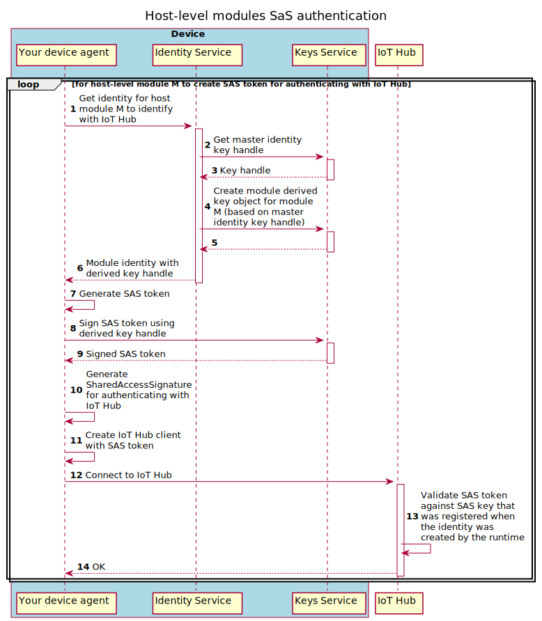

# Creating an IoT agent

This document covers how a Linux process (e.g. a systemd service) can leverage APIs exposed by the [Identity](api/identity-service.md) (IS), [Keys](api/keys-service.md) (KS), and [Certificates](api/certificates-service.md) (CS) Service daemons to establish a connection to Azure IoT Hub using a [module identity](https://docs.microsoft.com/en-us/azure/iot-hub/iot-hub-devguide-module-twins). A _module identity_ is the same type of cloud identity used by [Edge modules](https://docs.microsoft.com/azure/iot-edge/iot-edge-modules#module-identities) to communicate with IoT Hub. 

The APIs for IS/KS/CS are all exposed to processes on the local host over Unix Domain Sockets (UDS). The services enable your agent (or, more generally, any authorized process) to co-exist side by side with other agents as well as IoT Edge modules (if IoT Edge is installed). They all appear as modules under the same logical device in IoT Hub and can be accessed via your back-end cloud solution. 

> **Note**
>
> The IS/KS/CS services can also be used by a process to connect to Hub using the device identity. However, in practice, that should not be used. The device identity is more privileged than a module identity as it has ownership for the module identities. 
>
> Furthermore, two separate processes cannot simultaneously connect to Hub using the same identity. Unless you own the device and can guarantee that only your process will ever use the device identity, you should stick to using a module identity. 

**Differences with Edge modules**

[IoT Central](https://docs.microsoft.com/azure/iot-central/core/overview-iot-central) only supports Edge modules. It does not provide UI for arbitrary agents using a module identity to connect to Azure.

The Identity Service package does not provide non-Edge modules with higher-level capabilities that come with IoT Edge.

Edge modules are managed through the [IoT Edge runtime](https://docs.microsoft.com/azure/iot-edge/about-iot-edge#iot-edge-runtime) which enables:
- Deploying cloud workloads to an edge device
- Monitoring the health of the deployed Edge modules
- Gathering and reporting runtime quality metrics
- Operating offline for an indefinite period of time
- Managing communication between Edge modules
- Remotely restarting a module or retrieving logs

## Prerequisites

[Install the `aziot-identity-service` package](installation.md) which installs the IS/KS/CS services.

Alternatively, [install IoT Edge v1.2 or later](https://docs.microsoft.com/azure/iot-edge/how-to-install-iot-edge?view=iotedge-2020-11). It includes the `aziot-identity-service` package as a dependency.

### Configuration for Provisioning

For demonstration purposes, we <u>m</u>anually <u>p</u>rovision the device with a connection string. However, the Identity Service can be configured to use any of the following methods.
1. manually using a connection string
1. manually using X.509 certificates
1. via DPS using X.509 certificates (self-signed or CA-signed)
1. via DPS using TPM attestation

We'll use the `config mp` convenience command:

* If you have installed _IoT Edge v1.2+_, then use the `iotedge` CLI.

    ```bash
    sudo iotedge config mp -c "<conn_string>"

    sudo iotedge config apply
    ```

* Otherwise, if only the _Identity Service_ is installed, use the more basic `aziotctl` CLI.

    ```bash
    sudo aziotctl config mp -c "<conn_string>"

    sudo aziotctl config apply
    ```

    > **Note**
    >
    > The `aziotctl` CLI isn't aware of IoT Edge and only provides a subset of functionality found in the `iotedge` CLI. Use the `iotedge` CLI when available.

#### Alternative Provisioning Methods

For the other provisioning methods, start by creating a config file. Modify it to set appropriate values and then apply the new configuration when you're done.

For example:

* If you have installed _IoT Edge v1.2+_, then use `/etc/aziot/config.toml.edge.template`.

    ```bash
    sudo cp /etc/aziot/config.toml.edge.template /etc/aziot/config.toml

    # make configuration edits
    sudo $EDITOR /etc/aziot/config.toml

    sudo iotedge config apply
    ```

* Otherwise, if only the _Identity Service_ is installed, use the more basic `/etc/aziot/config.toml.template` that does not include any IoT Edge-specific configuration options.

    ```bash
    sudo cp /etc/aziot/config.toml.template /etc/aziot/config.toml

    # make configuration edits
    sudo $EDITOR /etc/aziot/config.toml

    sudo aziotctl config apply 
    ```

### Verify the Install

Use this curl command to quickly test that the Identity Service is working. You may need to wait a few seconds after applying the configuration above before it will work.

```bash
# as the root user, get the device identity information  
sudo curl --unix-socket '/run/aziot/identityd.sock' 'http://identityd.sock/identities/identity?api-version=2020-09-01'
```

## Client Authorization

Before your agent can connect to IS/KS/CS, it must be authorized. The authorization mechanism is based on OS users.
Only authorized OS user accounts are allowed to connect to the IS/KS/CS services. 

Authorizing your host module involves the following steps. You should do these as part of your agent's installation process.
1. Create a unique user account under which your process will run.
1. Add that new user to the respective groups for the Identity, Cert, and Keys service; thereby granting permissions to access the sockets.
1. Register the OS user ID (i.e. process principal) and the module identity name you'll use with the Identity Service.

A real-world example of handling this during package installation is in the `postinst` script for the [Device Update for IoT Hub package code](https://github.com/Azure/iot-hub-device-update/blob/main/packages/debian/postinst). 

For simplicity, these steps are also illustrated using the bash commands below. They assume `mymodule` is the module identity the agent will use. The module runs under a `myuserid` user in group `mygroupid`.

```bash
# Get device identity information as root user.
# Create a new user for your host process, say myuserid:myuserid

groupadd -r myuserid

useradd -r -g myuserid -c 'Service user for <mymodule>' -s /sbin/nologin -d /var/lib/mymodule myuserid

# Add the new user to the three groups for talking to the three services.

usermod -aG aziotid myuserid
usermod -aG aziotcs myuserid
usermod -aG aziotks myuserid

# Register the host process principal with the identity service via a mymodule.toml registration entry added to the /etc/aziot/identityd/config.d/ folder.

>/etc/aziot/identityd/config.d/mymodule.toml cat <<-EOF
[[principal]]
uid = $(id -u myuserid)
name = "mymodule"
idtype = ["module"]
EOF

# Set ownership of your registration entry to the Identity Service
sudo chown aziotid:aziotid /etc/aziot/identityd/config.d/mymodule.toml

# Set the registration entry to be -rw-------.
sudo chmod 0600 /etc/aziot/identityd/config.d/mymodule.toml
```

## Connecting Your Agent to IoT Hub

The logic to authenticate with Hub depends on the _authentication type_ of the identity your agent uses. Currently (v1.2), the Identity Service only enables module identities that use symmetric keys as their authentication type. 

The table below summarizes the cases your agent must support when it has registered with IS to use the device identity or a module identity. 

| Identity Type | Authentication Type | Must Support |
| :---------------- | :-------------- | :-------------- |
| Device | Symmetric key (e.g. connection string) | SaS authentication |
| Device | X.509 certificates | Must support |
| Device | TPM attestation | N/A ? |
| Module | Symmetric key (e.g. connection string) | SaS authentication |
| Module | X.509 certificates | Not supported by IS (yet) |
| Module | TPM attestation | N/A |

If your agent uses a module identity (recommended) then the only method you **must** support is SaS authentication (i.e. using the symmetric key to sign a token and including it in a connection string). 

Although not required, we recommend future-proofing your agent by including the logic to support X.509 authentication. The Identity Service does not yet support X.509 authentication for modules. You can test your logic with a device identity. The practical differences in your implementation when using device versus module identity are negligible.

The next sections use bash script to highlight the concepts of how to use the Identity / Keys / Cert services to connect to Hub. The [Device Update agent](https://docs.microsoft.com/azure/iot-hub-device-update/device-update-agent-provisioning) again serves as a real world example. It handles both authentication types. As part of its startup sequence, it retrieves the [provisioning information](https://github.com/Azure/iot-hub-device-update/blob/7a6e4c12d54df7a92984e935c3050f35e359a342/src/agent/src/main.c#L755) and uses it to [create the client](https://github.com/Azure/iot-hub-device-update/blob/7a6e4c12d54df7a92984e935c3050f35e359a342/src/agent/src/main.c#L485). In particular, the [RequestConnectionStringFromEISWithExpiry](https://github.com/Azure/iot-hub-device-update/blob/7a6e4c12d54df7a92984e935c3050f35e359a342/src/utils/eis_utils/src/eis_utils.c#L397) utility function implements many of the concepts discussed in the next sections for SaS and X.509 authentication.

### SaS authentication with a Connection String Walkthrough

The sequence diagram and examples below show the steps to create a signed token, the Shared Access Signature, and the final connection string to use with the C SDK.

_Sequence diagram for runtime operations_



> **Note**
>
> You'll find these same steps in the larger context of the [overall runtime operation detailed sequence diagram](https://raw.githubusercontent.com/Azure/iot-identity-service/main/docs/img/est-ca-runtime-operation-detailed.svg) as the "Host-level modules process operations" segment; specifically (lines 17-30).

It's instructive to try these manually. Create a dummy registration with IS for `mymodule` that authorizes the root user to call the local REST APIs.

```bash
>/etc/aziot/identityd/config.d/mymodule.toml cat <<-EOF
[[principal]]
uid = 0
name = "mymodule"
idtype = ["module"]
EOF

sudo chown aziotid:aziotid /etc/aziot/identityd/config.d/mymodule.toml

sudo chmod 0600 /etc/aziot/identityd/config.d/mymodule.toml
```

#### **Step 1** Get identity information

Send the request to the identity endpoint, `/run/aziot/identityd.sock`. Use the [`/identities/identity`](api/identity-service.md#get-primary-cloud-identity-for-authenticated-workload) REST API to retrieve the identity you previously registered for your process as part of installation.

If the connection is refused, retry after a few seconds.

_Note_: To run the sample script below, you may need to first install `jq` (e.g. `sudo apt install jq`).

```bash
# Call IS as the root user to skip the need to add my user to the requisite security groups for IS/KS/CS. 
identity="$(sudo curl --unix-socket '/run/aziot/identityd.sock' 'http://identityd.sock/identities/identity?api-version=2020-09-01')" 

# From the response, retrieve the hubName, gatewayHost, device and module identity, authentication type, and the key handle.
hub_name="$(<<< "$identity" jq -r '.spec.hubName')"
gateway_host="$(<<< "$identity" jq -r '.spec.gatewayHost')"
device_id="$(<<< "$identity" jq -r '.spec.deviceId')"
module_id="$(<<< "$identity" jq -r '.spec.moduleId // ""')"
auth_type="$(<<< "$identity" jq -r '.spec.auth.type')"
key_handle="$(<<< "$identity" jq -r '.spec.auth.keyHandle')"
```

#### **Step 2** Build a base64-encoded resource URI that expires

Concatenate the URL-encoded `resource_uri` with a desired expiry. The script below uses an expiry of 1 day from today. 

In the next step, you generate the signed token to connect to IoT Hub by calling the Keys Service's `/sign` API and providing this string as the **message** parameter. The parameter must be a base64-encoded value. 

> **Note**
>
> After expiry the client will be unable to connect using the generated SaS token. You will need to repeat the steps to build a new token and client based on a new expiry. This is not shown here.

More details on how the IoT Hub service interprets this signed message can be found in the docs on [Security tokens](https://docs.microsoft.com/azure/iot-hub/iot-hub-devguide-security#security-tokens). 

```bash

# URL-encode the resource of hub + device + module
# If we were doing this for the device identity, the resource_uri wouldn't include the '/modules/%s'
resource_uri="$(printf '%s/devices/%s/modules/%s' "$hub_name" "$device_id" "$module_id" | jq -sRr @uri)"

# Expiry of 1 day from today in Unix epoch time
expiry="$(bc <<< "$(date +%s) + 60 * 60 * 24")"

# Full string to be signed is a base64-encoded string containing the URL-encoded resource URI and the expiry
signature_data="$(printf '%s\n%s' "$resource_uri" "$expiry" | base64 -w 0)"
```

#### **Step 3** Get a signed token from the Keys Service

Send a request to the Keys Service endpoint `/run/aziot/keyd.sock` to sign the base64-encoded value using the HMAC-SHA256 algorithm.

If the connection is refused, go back to Step 1 since IoT Hub device information could have changed.

Otherwise, parse the `signature` from the response.

```bash
# Parse and URL-decode the 'signature' from the response
signature="$(
    sudo curl --unix-socket '/run/aziot/keyd.sock' \
        -X POST -H 'content-type: application/json' --data-raw "$(
            jq -cn --arg 'keyHandle' "$key_handle" --arg 'message' "$signature_data" '{
                "keyHandle": $keyHandle,
                "algorithm": "HMAC-SHA256",
                "parameters": {
                    "message": $message,
                },
            }'
        )" 'http://keyd.sock/sign?api-version=2020-09-01' |
        jq '.signature' -r |
        sed -e 's|+|%2b|g' -e 's|/|%2f|g' -e 's|=|%3d|g'
)"

# Construct the full SaS token
sas_token="$(printf 'sr=%s&se=%s&sig=%s' "$resource_uri" "$expiry" "$signature")"
```

#### **Step 4**: Create the full connection string

The device may have been configured to connect directly to IoT Hub, or it may be connecting via a gateway. It's direct if the `gatewayHost` obtained previously in **Step 1** is the same as the `hubName`. If they differ, then connection string should use the gateway host name.

```bash
# Note that the 'SharedAccessSignature' appears both in the connection string and in the value for it.
sas="SharedAccessSignature $sas_token"

if [ "$hub_name" = "$gateway_host" ]; then
    # Connecting directly to Hub.
    echo "HostName=$hub_name;DeviceId=$device_id;ModuleId=$module_id;SharedAccessSignature=$sas"
else
    # Connecting via a gateway (e.g. in a nested configuration). Include the gateway name in the connection string.
    echo "HostName=$hub_name;DeviceId=$device_id;ModuleId=$module_id;SharedAccessSignature=$sas;GatewayHost=$gateway_host"
fi

```

#### **Step 5** Use the SDK to connect to IoT Hub

For example, use the C SDK's [IoTHubDeviceClient_LL_CreateFromConnectionString](https://docs.microsoft.com/azure/iot-hub/iot-c-sdk-ref/iothub-device-client-ll-h/iothubdeviceclient-ll-createfromconnectionstring) API to create a client from the connection string.

#### **Step 6** After disconnect

Repeat all steps starting from _Step 1_ above to re-connect.

### X.509 authentication for Modules

Currently, host processes using module identities can only authenticate against IoT Hub using the SaS authentication method. 

It is beneficial that you include and validate X.509 authentication in the short term (by registering a device principal) so that module X.509 authentication can be easily supported in the future. 

#### Registering a Device Principal

Registering a device principal is similar to registering a module shown earlier. Instead of using an `idtype = module` it uses an `idtype = device`. This is an option that could be removed in the future, but is currently available for testing.

```bash
# This assumes myuserid has been added to the groups: aziotid, aziotks, aziotcs
>/etc/aziot/identityd/config.d/myagent.toml cat <<-EOF
[[principal]]
uid = $(id -u myuserid)
name = "hostprocess1"
idtype = ["device"]
EOF

sudo chown aziotid:aziotid /etc/aziot/identityd/config.d/myagent.toml

sudo chmod 0600 /etc/aziot/identityd/config.d/myagent.toml
```

#### TLS Authentication w/ Keys Stored in an HSM

X.509 private keys are not exposed outside the Keys Service (e.g. may only exist in an HSM and never loaded into memory). An OpenSSL engine for the Keys Service that can be used with the C SDK to enable processes to perform TLS authentication against IoT Hub is provided. 

Code snippet samples for using OpenSSL engines with the C SDK are available [here](https://github.com/azure/azure-iot-sdk-c/blob/master/iothub_client/devdoc/iothubclient_c_library.md#openssl-engine-examples). You can also see where it's used in the implementation for the Device Update agent [here](https://github.com/Azure/iot-hub-device-update/blob/7a6e4c12d54df7a92984e935c3050f35e359a342/src/agent/src/main.c#L518).

## Device and Module Provisioning

The IS daemon interacts with cloud services (i.e. DPS and IoT Hub) to provision the device and its modules. After a device has been successfully provisioned (either manually with Hub or via [DPS](https://docs.microsoft.com/azure/iot-dps/about-iot-dps)), the IS daemon goes through a reconciliation process with its assigned Hub. 

The module identities that have been registered with IS are automatically created as part of the reconciliation. This enables you to pre-install your agent on a device and avoid the complexity of dealing with (re)provisioning and generating new module identities for the device after it has moved to a new Hub.

> **Notes**
>
> * Reprovisioning a device may trigger re-creation of module identities with IoT Hub.
> * A higher policy application may incorporate its own logic to determine automatic reprovisioning and then trigger it via the [reprovision](api/identity-service.md#trigger-iot-device-reprovisioning-flow) API that the Identity Service exposes. 
>   * For example, by default IoT Edge automatically reprovisions the device when it detects the device may have moved from one IoT Hub to another. See the [`Dynamic` option](https://github.com/Azure/iotedge/blob/944f9098d61db29d484aca8e432acf3c5d9a4366/edgelet/contrib/config/linux/template.toml#L36) for the `auto_reprovisioning_mode`.
> * The Identity Service is considered a "low policy" device component on which others may build. Its default behavior for reprovisioning is equivalent to the [`OnErrorOnly` behavior](https://github.com/Azure/iotedge/blob/944f9098d61db29d484aca8e432acf3c5d9a4366/edgelet/contrib/config/linux/template.toml#L46) of IoT Edge's `auto_reprovisioning_mode` option.

## API docs

- [Identity Service](api/identity-service.md)
- [Keys Service](api/keys-service.md)
- [Certificates Service](api/certificates-service.md)

## Additional References

* [Device Provisioning Service (DPS)](https://docs.microsoft.com/azure/iot-dps/about-iot-dps)
* [Managing identities in IoT Hub](https://docs.microsoft.com/azure/iot-hub/iot-hub-devguide-identity-registry)
* [Control access to IoT Hub](https://docs.microsoft.com/azure/iot-hub/iot-hub-devguide-security)
  * [Security tokens](https://docs.microsoft.com/azure/iot-hub/iot-hub-devguide-security#security-tokens)
  * [Supported X.509 certificates](https://docs.microsoft.com/azure/iot-hub/iot-hub-devguide-security#supported-x509-certificates)
* [Device and service SDKs](https://docs.microsoft.com/azure/iot-hub/iot-hub-devguide-sdks)

